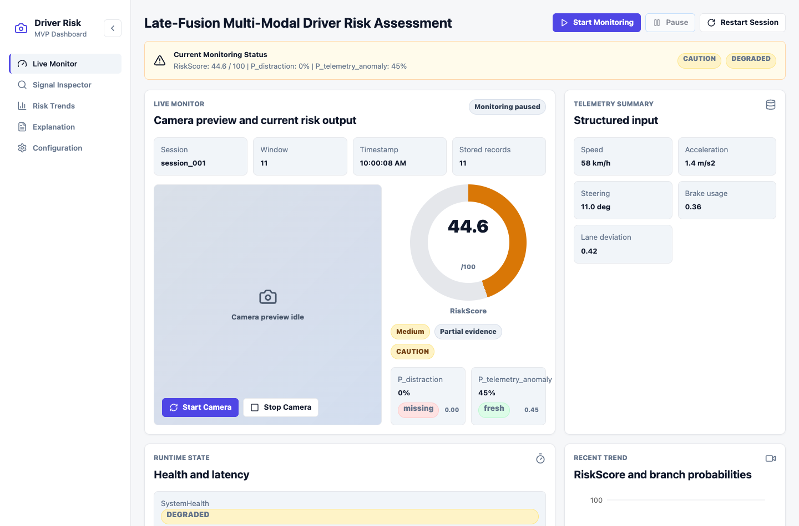
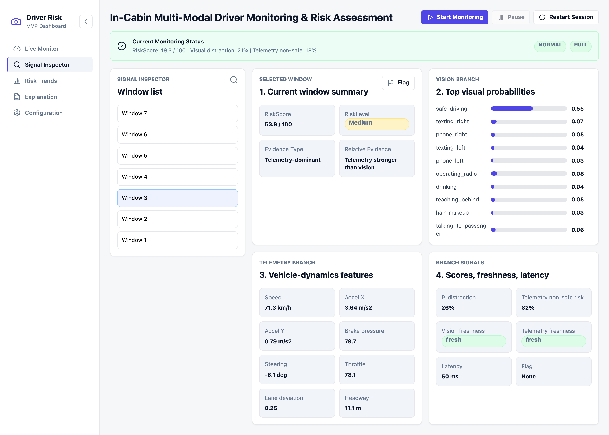
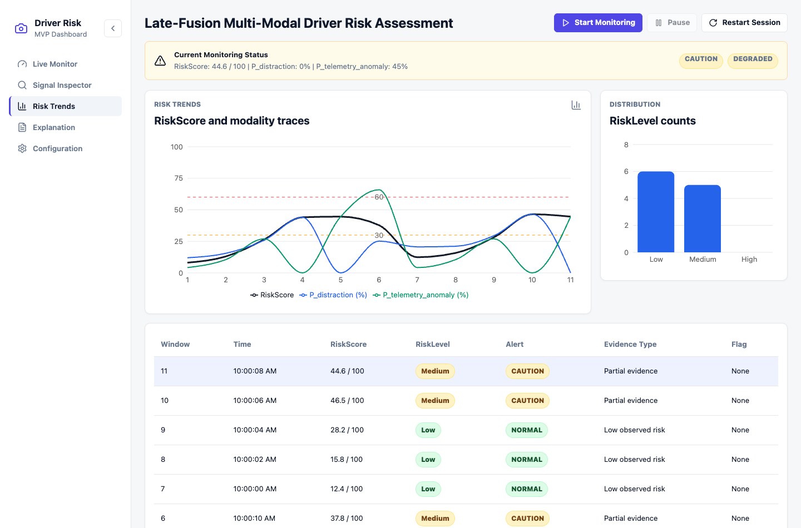
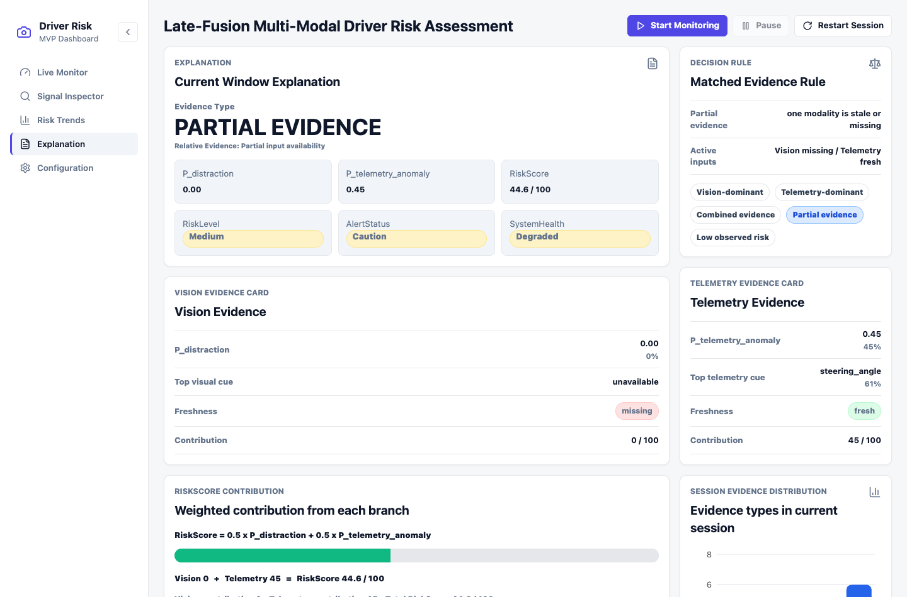
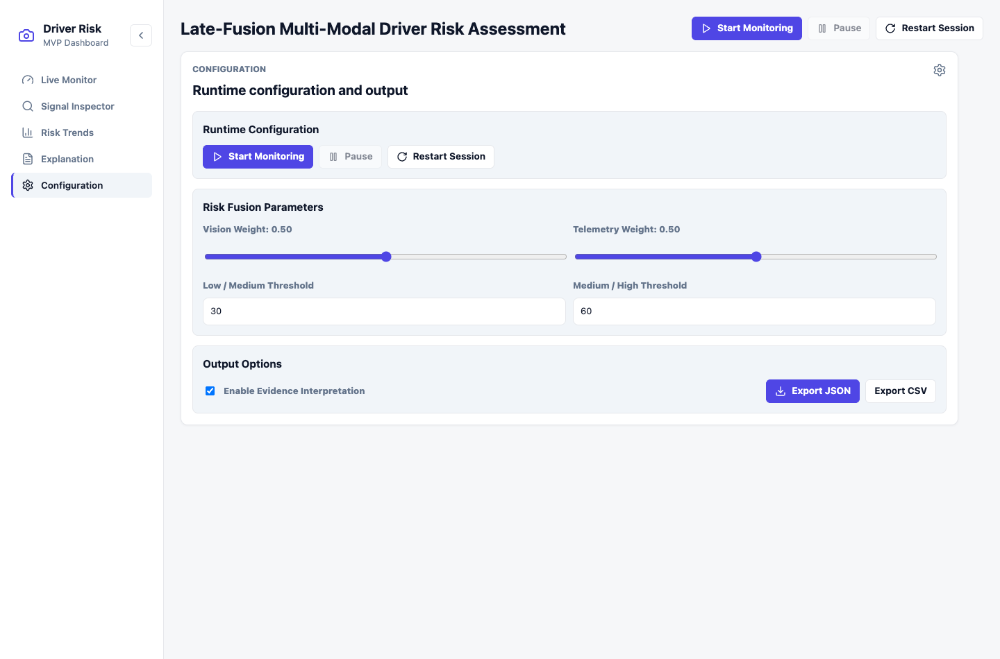

# In-Cabin Multi-Modal Driver Monitoring & Risk Assessment

Functional React + TypeScript MVP prototype for the FYP multi-modal driver risk
assessment framework.

## Logical Structure

```text
frontend/
  React/Vite dashboard, browser runtime, local session logging, export helpers
backend/
  Backend/API integration boundary for future FastAPI/WebSocket/model serving
ai/
  Shared risk contract, late-fusion logic, evidence rules, prepared prototype data
docs/
  Prototype explanation, UI screenshots, and presentation support documents
prototype-tests/
  Lightweight manual smoke-test checklist for the prototype
```

The root keeps project-level tooling only: `package.json`, `vite.config.ts`,
`tsconfig.json`, `eslint.config.js`, `README.md`, and `Changelog.md`.

The prototype implements the report and guidebook baseline:

- weighted late-fusion risk scoring from `P_distraction` and
  `P_telemetry_anomaly`, displayed as a 0-100 `RiskScore`
- `RiskScore`, `RiskLevel`, `DominantEvidence`, `AlertSeverity`, `SystemHealth`,
  and freshness payloads
- Live Monitor, Risk Trends, Signal Inspector, Explanation, and Configuration
  views
- browser camera preview with permission handling
- prepared session dataset for ordered runtime windows; no video upload workflow
- localStorage CRUD under `session_log:{session_id}`
- JSON/CSV session log export with optional evidence interpretation fields

## Run

```bash
npm install
npm run dev
```

The development server binds to `127.0.0.1`. See
[docs/prototype-summary.md](/Users/liu/Desktop/FYP-In-Cabin-Driver-Assessment--1/docs/prototype-summary.md)
for the completed modules and function-level usage notes.
See
[docs/explanation-implementation-guide.zh.md](/Users/liu/Desktop/FYP-In-Cabin-Driver-Assessment--1/docs/explanation-implementation-guide.zh.md)
for the Chinese guide to implementing explanation with vision and telemetry
models.
See
[docs/system-explanation-script.zh.md](/Users/liu/Desktop/FYP-In-Cabin-Driver-Assessment--1/docs/system-explanation-script.zh.md)
for a concise Chinese explanation script of the runtime pipeline.

## Interface Screenshots

### Live Monitor

Displays the current monitoring window, fused risk score, branch probabilities,
alert status, system health, latency, and recent trend.



### Signal Inspector

Supports window-level review of historical monitoring records, including visual
evidence, telemetry features, freshness, latency, and flag status.



### Risk Trends

Shows session-level risk progression, branch probability traces, risk-level
distribution, and historical records.



### Explanation

Explains the current risk output using matched evidence rules, branch evidence,
and weighted contribution breakdown.



### Configuration

Provides runtime controls for monitoring, fusion weights, risk thresholds,
evidence interpretation export, and JSON/CSV session log export.


